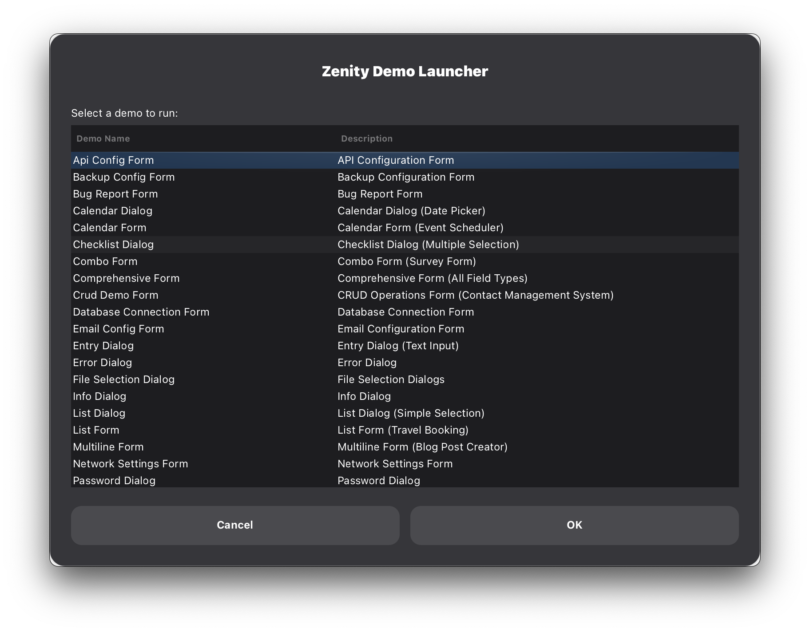

# Zenity Wrapper Demos

Individual demo scripts showcasing each dialog and form type.



## Running Demos

Navigate to the demos folder and run any demo:

```bash
cd demos
python3 info_dialog.py
```

## Message Dialogs

| Script | Description |
|--------|-------------|
| `info_dialog.py` | Information message dialog |
| `warning_dialog.py` | Warning message dialog |
| `error_dialog.py` | Error message dialog |
| `question_dialog.py` | Yes/No question dialog with custom buttons |

## Input Dialogs

| Script | Description |
|--------|-------------|
| `entry_dialog.py` | Single-line text input |
| `password_dialog.py` | Password entry (hidden text) with optional username |
| `scale_dialog.py` | Slider/scale for numeric input |
| `calendar_dialog.py` | Date picker with age calculation |

## Selection Dialogs

| Script | Description |
|--------|-------------|
| `list_dialog.py` | Simple list selection |
| `checklist_dialog.py` | Multiple selection checklist |
| `radiolist_dialog.py` | Single selection radio list |
| `file_selection_dialog.py` | File/directory picker (open/save/multiple) |

## Progress Dialogs

| Script | Description |
|--------|-------------|
| `progress_dialog.py` | Progress bars (percentage & pulsating) |

## Form Dialogs

### Simple Forms

| Script | Description | Fields |
|--------|-------------|--------|
| `simple_form.py` | Basic contact form | 3x entry |
| `password_form.py` | Login/registration form | entry + 2x password |
| `multiline_form.py` | Blog post creator | entry + multiline + entry |

### Advanced Forms

| Script | Description | Fields |
|--------|-------------|--------|
| `calendar_form.py` | Event scheduler | entry + calendar + entry + multiline |
| `combo_form.py` | Survey form | entry + 3x combo |
| `list_form.py` | Flight booking | entry + list + calendar + combo |
| `comprehensive_form.py` | **All 6 field types** | entry + password + multiline + calendar + combo + list |

### Practical/Reusable Forms

Real-world form templates you can adapt for your projects:

| Script | Description | Use Case |
|--------|-------------|----------|
| `settings_form.py` | Application settings/preferences | App configuration, theme, language, auto-save |
| `database_connection_form.py` | Database connection config | PostgreSQL, MySQL, MongoDB connections |
| `bug_report_form.py` | Bug/issue reporting | Development tools, issue tracking |
| `email_config_form.py` | Email account setup | SMTP configuration, Gmail, Outlook |
| `server_config_form.py` | Server/API settings | Server deployment, protocol, environment |
| `user_profile_form.py` | User profile editor | Account management, profile updates |
| `backup_config_form.py` | Backup configuration | Automatic backups, retention policies |
| `network_settings_form.py` | Network configuration | IP settings, DNS, proxy, WiFi |
| `product_order_form.py` | E-commerce order form | Product orders, checkout process |
| `api_config_form.py` | API integration config | REST API setup, authentication, rate limits |

## Advanced Dialogs

| Script | Description |
|--------|-------------|
| `text_dialog.py` | Text viewer/editor with scrolling |

## Field Types Reference

All form field types demonstrated:

1. **entry** - Single-line text input
2. **password** - Hidden password input
3. **multiline** - Multi-line text area
4. **calendar** - Date picker
5. **combo** - Dropdown selection
6. **list** - List selection with headers

## Quick Test All Demos

Run this command to test all demos in sequence:

```bash
for demo in *.py; do
    echo "Running $demo..."
    python3 "$demo"
    echo "---"
done
```

## Tips

- All demos are standalone and can run independently
- Use `Ctrl+C` to interrupt if needed
- Some demos show multiple dialog types in sequence
- Check terminal output for results
- Modify the scripts to experiment with different options
